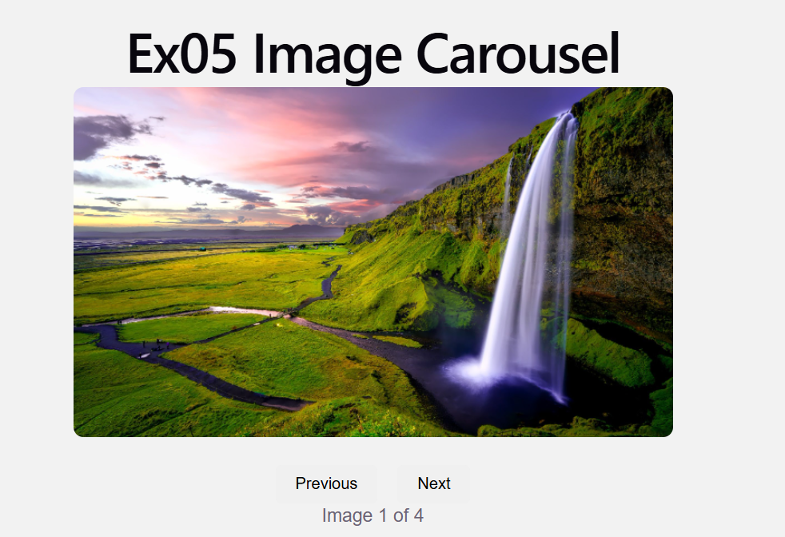
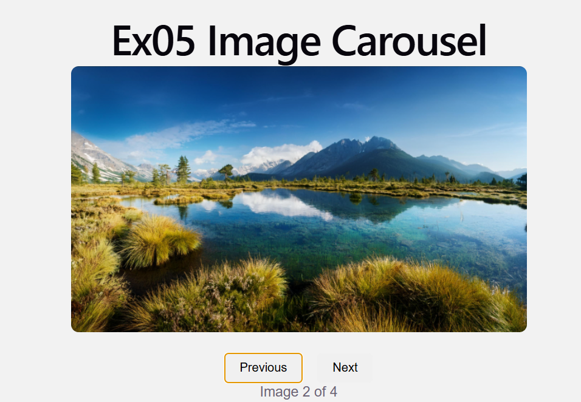
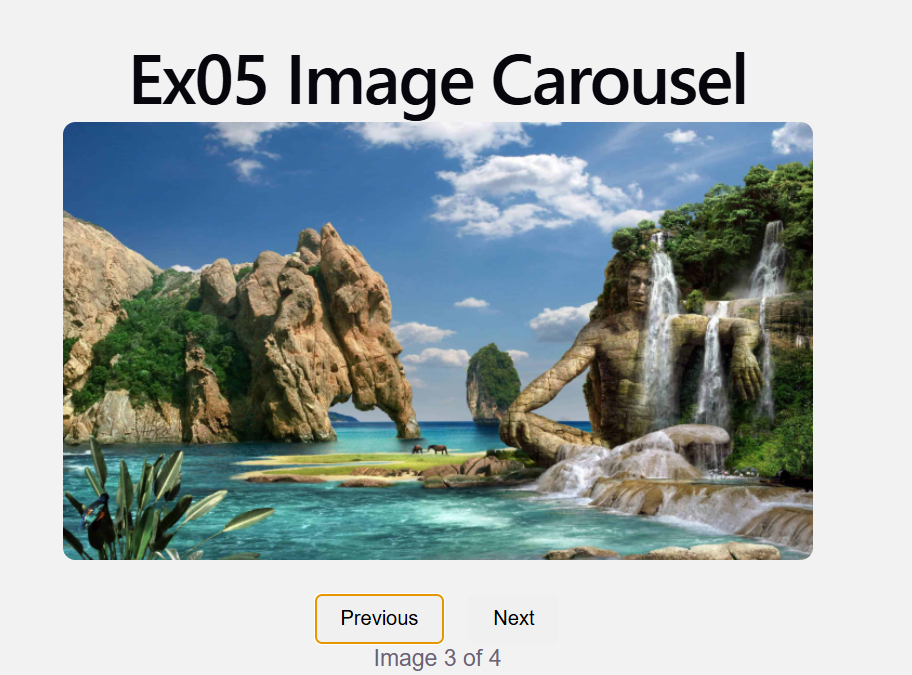
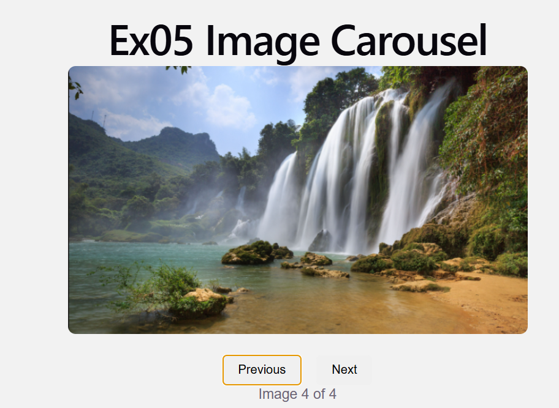

# Ex05 Image Carousel
## Date:04/09/2026

## AIM

To create an Image Carousel using React.

## ALGORITHM

### STEP 1: Initial Setup

**Input:** A list of images to display in the carousel.

**Output:** A component displaying the images with navigation controls such as Next and Previous buttons.

### STEP 2: State Management

Use a state variable `currentIndex` to track the index of the current image displayed.

The carousel starts with the first image, so initialize `currentIndex` to `0`.

### STEP 3: Navigation Controls

**Next Image:** When the "Next" button is clicked, increment `currentIndex`.

If `currentIndex` is at the end of the image list (last image), loop back to the first image using:

`currentIndex = (currentIndex + 1) % images.length`

**Previous Image:** When the "Previous" button is clicked, decrement `currentIndex`.

If `currentIndex` is at the beginning (first image), loop back to the last image using:

`currentIndex = (currentIndex - 1 + images.length) % images.length`

### STEP 4: Displaying the Image

The `currentIndex` determines which image is displayed.

Using the `currentIndex`, display the corresponding image from the images list.

### STEP 5: Auto-Rotation

Set an interval to automatically change the image after a set amount of time, such as 3 seconds.

Use `setInterval` to change the current image at regular intervals.

Clean up the interval when the component unmounts using `clearInterval` to prevent memory leaks.

## PROGRAM

The Image Carousel is implemented using React with state management, navigation buttons, and automatic image rotation.
```
App.jsx
import { useState, useEffect } from "react";
import "./App.css";

import image1 from "./assets/image1.jpg";
import image2 from "./assets/image2.jpg";
import image3 from "./assets/image3.jpg";
import image4 from "./assets/image4.jpg";

function App() {
  const images = [image1, image2, image3, image4];

  const [currentIndex, setCurrentIndex] = useState(0);

  const nextImage = () => {
    setCurrentIndex((currentIndex + 1) % images.length);
  };

  const previousImage = () => {
    setCurrentIndex(
      (currentIndex - 1 + images.length) % images.length
    );
  };

  useEffect(() => {
    const interval = setInterval(() => {
      setCurrentIndex(
        (currentIndex) => (currentIndex + 1) % images.length
      );
    }, 3000);

    return () => clearInterval(interval);
  }, []);

  return (
    <div className="carousel">
      <h1>Ex05 Image Carousel</h1>

      

      <div className="buttons">
        <button onClick={previousImage}>Previous</button>
        <button onClick={nextImage}>Next</button>
      </div>

      <p>
        Image {currentIndex + 1} of {images.length}
      </p>
    </div>
  );
}

export default App;
```
```
App.css
body {
  margin: 0;
  font-family: Arial, sans-serif;
  background: #f2f2f2;
}

.carousel {
  text-align: center;
  margin-top: 50px;
}

.carousel h1 {
  margin-bottom: 25px;
}

.carousel-image {
  width: 600px;
  height: 350px;
  object-fit: cover;
  border-radius: 10px;
}

.buttons {
  margin-top: 20px;
}

button {
  padding: 10px 20px;
  margin: 0 10px;
  border: none;
  border-radius: 5px;
  cursor: pointer;
  font-size: 16px;
}

button:hover {
  background: #ddd;
}
```
## OUTPUT

The React Image Carousel displays images with **Previous** and **Next** navigation buttons. The images automatically change every 3 seconds.





## RESULT
The program for creating an Image Carousel using React was executed successfully.
